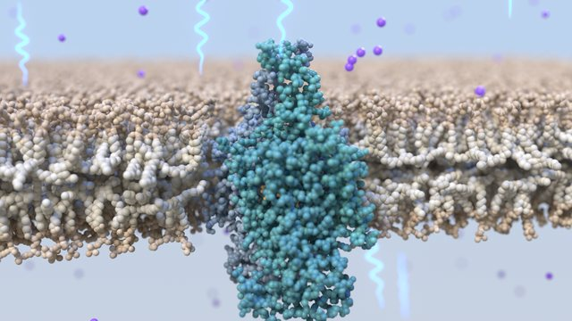
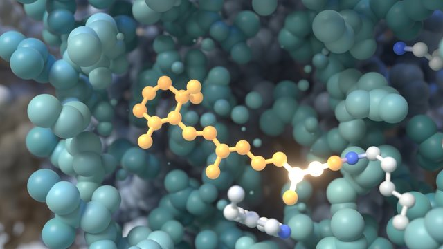
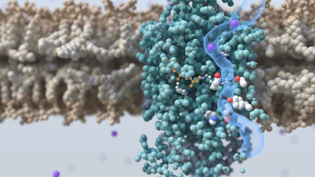
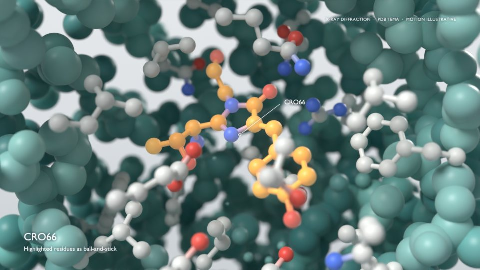

# Molecular Animation

[](https://github.com/AmadeusBio-ai/Molecular_Animation/actions/workflows/ci.yml)
[](LICENSE)

**An open framework for turning a scientific brief into an honest, beautiful molecular animation with Blender.** You hand over a request, a paper-style brief or a reference, and you get back:
- a scripted Blender 5.2 scene built from PDB structures;
- rendered takes;
- labelled and clean MP4/WebM films with posters;
- a production record that states, beat by beat, what is experimental and what is illustrative.

It is designed to be driven by an AI agent (Claude Code through Blender MCP) and works just as well by hand.

| | | |
| --- | --- | --- |
|  |  |  |

*Case study: [channelrhodopsin](examples/channelrhodopsin/), from a brief on the 2026 Nobel Prize in Physiology or Medicine. A photon twists retinal, the protein responds, and a cation pathway opens. 21 s, built from PDB 9GO1/9GO2.*

## What's inside

- **`molanim`, the framework.**
  - A pure-numpy science layer: mmCIF and assemblies, atom-matched states, constrained morphs, pathway profiles, procedural membranes, illustrative ion motion, camera paths. It is unit-tested and runs anywhere.
  - A Blender layer: sphere and ball-and-stick molecules with camera-aimed cutaways, cavity tubes, interaction markers, a studio look, a depth-of-field camera rig, and a separate label pass for captions, evidence tags and pointers.
- **`pipeline.py`.** One command line for the whole production: `new` → `build` → `still` → `preview` → `render` → `deliver`, plus `doctor`, `motion` (jump and seam detection), `smoke` and `check` (re-render a poster frame and compare it with the delivery).
- **A workflow and principles** for films that are both beautiful and scientifically honest: [docs/workflow.md](docs/workflow.md), [docs/principles.md](docs/principles.md).
- **An agent guide** ([AGENTS.md](AGENTS.md)) and a `/new-film` skill for Claude Code.

## Quick start

You need Blender 5.2, a Cycles-capable GPU (NVIDIA OptiX recommended), ffmpeg with libx264 and libvpx-vp9, and Python 3.10+. The details, including Blender MCP, are in [docs/setup.md](docs/setup.md).

```
git clone https://github.com/AmadeusBio-ai/Molecular_Animation.git
cd Molecular_Animation
pip install -r requirements.txt
python pipeline.py doctor                      # Blender, GPU, ffmpeg, Python packages, structure checksums
python -m pytest tests                         # framework + case-study science, no Blender needed
```

Start a film from any PDB entry:

```
python pipeline.py new gfp --pdb 1EMA --title "Green fluorescent protein"
python pipeline.py build gfp                   # ~3 s: projects/gfp/gfp.blend
python pipeline.py still gfp 165 --percent 50  # look at it
```



*What the template produces, untouched, for 1EMA. It dives through a cutaway to the largest ligand (here the chromophore CRO66), shows its pocket as ball-and-stick, and labels the experimental method with "motion illustrative". Use `--loop` for a seamless orbit instead.*

From there, edit the storyboard constants at the top of `projects/gfp/gfp.py`, add what the brief needs from `molanim`, and follow the [workflow](docs/workflow.md) through preview, final render and delivery.

## Making a film from a brief with Claude Code

Open Blender with the MCP add-on running, start Claude Code in this folder, and hand it the brief:

```
/new-film path/to/your-brief.md
```

The agent follows [docs/workflow.md](docs/workflow.md):
1. **Understand.** It writes a one-page brief: the one idea, structures and evidence levels, beats, look and deliverables.
2. **Ground the science.** It fetches the PDB entries and measures the claims the film depends on.
3. **Build** the shot from the template and `molanim`.
4. **Inspect** stills, a preview contact sheet and motion statistics.
5. **Refine** until it reads.
6. **Render and deliver.**
7. **Record** what was checked and how.

The case study shows the whole path from `sources/Nobel_Med_2026.md` to the delivered film.

## Repository layout

```
molanim/              the framework (pure-numpy science + molanim.blender)
pipeline.py           command-line pipeline; discovers examples/*/shots.json and projects/*/shots.json
examples/             finished case studies (channelrhodopsin)
projects/             your films (scaffolded by `pipeline.py new`)
templates/shot/       the project scaffold
assets/pdb/           structures from RCSB + SHA256SUMS
tools/                render.py (inside Blender), encode.py, MCP smoke test, Windows MCP launcher
tests/                pytest suite (runs in CI without Blender)
docs/                 workflow, principles, framework API, setup, Blender 5 notes
AGENTS.md, CLAUDE.md  agent guide; .claude/skills/new-film is the /new-film skill
```

`renders/`, `delivery/` and `.blend` files are build products and are ignored by git. The case study's delivered films are in the [v0.1.0 release](https://github.com/AmadeusBio-ai/Molecular_Animation/releases/tag/v0.1.0); get them with `python pipeline.py fetch channelrhodopsin`.

## Reproducibility

- **Scripts are the source.** Builds are idempotent and report their numerical checks in `RESULT`. For the case study these are the retinal dihedral path, the salt-bridge distance, the worst morph bond deviation, the pathway profile and the ion clearance.
- **Pinned inputs.** Structures are committed with checksums. Blender 5.2 is pinned. Every Blender call uses `--factory-startup`, and the GPU is selected explicitly.
- **Verified output.** `pipeline.py check` rebuilds a shot and compares a freshly rendered poster frame with the delivered one. After the case study was refactored onto `molanim`, its posters matched within 1/255 and its label frames were pixel-identical.

## Contributing

New case studies, framework features and portability fixes are welcome. See [CONTRIBUTING.md](CONTRIBUTING.md) and the [code of conduct](CODE_OF_CONDUCT.md).

## License and credits

- **Code and documentation:** Apache License 2.0 (`LICENSE`, `NOTICE`). © 2026 AmadeusBio.ai.
- **Structures:** from the [RCSB Protein Data Bank](https://www.rcsb.org); PDB data are CC0. The case study uses [9GO1](https://www.rcsb.org/structure/9GO1) and [9GO2](https://www.rcsb.org/structure/9GO2) (C1C2 channelrhodopsin).
- **Case-study brief:** generated with ChatGPT; provenance and share link in [examples/channelrhodopsin/sources/](examples/channelrhodopsin/sources/README.md).
- **Tools:** built with [Blender](https://www.blender.org) and the [Blender Lab MCP server](https://projects.blender.org/lab/blender_mcp).
